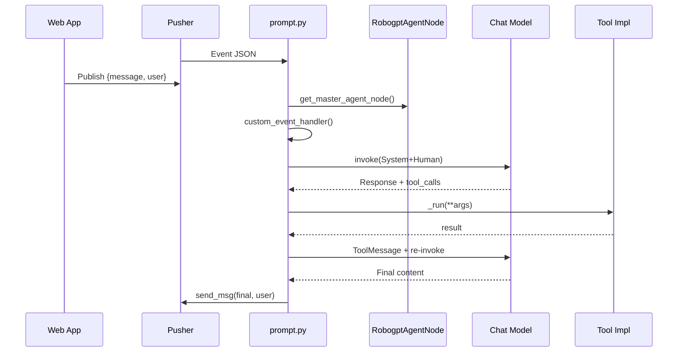

## RoboGPT Developer Guide

This guide is for developers working on the RoboGPT stack. It explains the module layout, the primary Python APIs, how to run the system, and the end-to-end execution flow with diagrams. It also documents all runtime arguments for quick reference.

---

### Repository layout (subset)

```
robogpt/
├─ core_stack/
│  ├─ robogpt_agents/
│  │  ├─ launch/
│  │  │  └─ run_agent.launch.py
│  │  └─ scripts/
│  │     ├─ agent_node.py
│  │     ├─ agent_utils.py
│  │     ├─ prompt.py
│  │     └─ pusher_auth.py
│  └─ process_manager/
│     ├─ manager_clients/
│     └─ manager_server/
├─ robogpt_startup/
│  ├─ launch/
│  ├─ scripts/
│  └─ setup/
└─ hardware_stack/
     ├─ hardware_description/
     └─ hardware_drivers/
```

---

## 1) Modules and responsibilities

- robogpt_agents
    - Agent runtime and ROS2 node glue for parameterization and heartbeat
    - Tool discovery and binding with the LLM runtime
    - Pusher-based realtime bridge to/from the web app

- robogpt_startup
    - Bring-up helpers and environment setup (e.g., keys and credentials)

- hardware_stack
    - Robot description packages (URDF/XACRO) and drivers (MoveIt, grippers)

---

## 2) Run commands and arguments

### 2.1 Start the RoboGPT Agent

```bash
ros2 launch robogpt_agents run_agent.launch.py \
    use_case:=base \
    robot_name:=owl65 \
    use_sim:=false \
    robot_ip:=192.168.1.200 \
    planner_type:=internal
```

Arguments (from run_agent.launch.py)

| Name | Type | Default | Description |
|---|---|---|---|
| use_case | string | base | Use case that selects tool set overlay (e.g., base, demo, custom) |
| reload_tools | bool | false | If true, forces re-discovery of tools |
| robot_name | string | owl65 | Robot to target for tasks (model name) |
| use_sim | bool | false | Run in simulation instead of a physical robot |
| robot_ip | string | 192.168.1.200 | IP address of the robot controller |
| planner_type | string | internal | Motion planner selection (internal, moveit, etc.) |

Notes
- The RobogptAgentNode declares the same parameters; keep defaults consistent between code and the launch file

### 2.2 Useful hardware stack commands (optional)

These live under hardware_stack and are useful while developing/testing:

```bash
# Example: visualize a robot (values vary by description package)
ros2 launch bot_description robot_spawn.launch.py robot_name:=ec64 add_camera:=true add_gripper:=true

# Gripper service
ros2 run robotiq_gripper robotiqGripperService.py
```

---

## 3) Execution flow diagrams

### 3.1 Message processing with tool-calling


### 3.2 Activity Diagram
***In development***

---

## 4) Extending the system

### 4.1 Adding tools

1) In robogpt_tools.applications.<use_case>.skills, define matching classes using the naming convention:
     - MyAction_definition(BaseModel)
     - MyAction_implementation(BaseTool)

2) The runtime will automatically pair them via agent_utils.extract_tools and register under the key "MyAction_definition".

3) Ensure each implementation’s _run(**kwargs) returns a JSON-serializable or string result – it is fed back to the LLM.

### 4.2 Environment configuration

The following environment variables are consumed at runtime (Pusher bridge):

- PUSHER_APP_ID
- NEXT_PUBLIC_PUSHER_KEY
- PUSHER_SECRET
- NEXT_PUBLIC_PUSHER_CLUSTER
- DEFAULT_PUSHER_KEY

Optional translator vars for translate_text:
- AZURE_TRANSLATOR_KEY, AZURE_TRANSLATOR_ENDPOINT, AZURE_TRANSLATOR_LOCATION

---

## 5) Troubleshooting

- No response from agent
    - Check Pusher credentials in env and network access
    - Confirm that listener connects and receives events

- Tools not discovered
    - Verify class names end with _definition and _implementation
    - Ensure the skills module is importable (PYTHONPATH/ROS package path)

- Robot connection issues
    - Validate robot_ip and planner_type
    - For simulation, set use_sim:=true and ensure sim stack is running

---

## 6) License and credits

Copyright © 2023–2025 Orangewood Labs.

Maintainers: Orangewood Robotics Team

---

# Appendix A — robogpt_startup (bring-up)

The package `core_stack/robogpt_startup` orchestrates a full bring-up: agents, vision, and robot (hardware vs simulation).

Key launchers
- `startup.launch.py` (Python): master bring-up launcher
- `robogpt_bringup.launch.py`, `robogpt_startup.launch.xml` (additional entry points)

Main launcher: startup.launch.py

Arguments

| Name | Type | Default | Description |
|---|---|---|---|
| use_case | string | base | Use case for the RoboGPT agent |
| reload_tools | bool | false | Force re-discovery of tools |
| robot_name | string | owl65 | Target robot model/name |
| use_sim | bool | false | Simulation mode (true) vs hardware (false) |
| robot_ip | string | 192.168.1.200 | Robot controller IP (hardware mode) |
| vision_sim | string | off | Vision simulation mode (on/off) |

What it launches
- RoboGPT Agents: includes `robogpt_agents/launch/run_agent.launch.py` with the above arguments
- Vision system: includes `robogpt_perception/launch/vision_bringup.launch.py` (no args inferred from code)
- Robot: conditionally includes `bot_description/launch/robot_spawn.launch.py`
    - If `use_sim:=true`: passes `use_js_pub:=true`, `rviz:=true`, `use_sim:=true`
    - Else hardware: `use_js_pub:=false`, `rviz:=false`, `use_sim:=false`

Example

```bash
ros2 launch robogpt_startup startup.launch.py \
    use_case:=base robot_name:=owl65 use_sim:=true vision_sim:=on
```

---

# Appendix B — hardware_drivers (Elite + Gripper)

The `hardware_stack/hardware_drivers` contains drivers for Elite arms and Robotiq grippers plus MoveIt adapters.

## Elite arm bringup

Launcher: `hardware_drivers/elite_arm_driver/launch/bringup.launch.py`

Arguments

| Name | Type | Default | Description |
|---|---|---|---|
| ip_address | string | 192.168.1.200 | Robot controller IP address |
| auto_connect | bool | True | Auto-connect on startup |
| use_fake | bool | False | Use fake driver mode |
| timer_period | number | 0.01 | Control loop period (s) |
| start_rviz | bool | False | (Currently not used/commented) |
| arm_type | string | ec66 | Arm model type (e.g., ec64, ec66) |
| add_holder | bool | false | Add end-effector holder in URDF |
| holder_model | string | camera_holder | Holder model to use |
| add_camera | bool | false | Add camera to the URDF |

What it does
- Starts `elite_arm_driver` node (parameters above)
- Generates robot_description via `ec_description/urdf/ec64/robot.xacro` with mappings `{use_gazebo:false, arm:arm_type, add_holder, holder_model, add_camera}`
- Starts `robot_state_publisher` with that description

Example

```bash
ros2 launch elite_arm_driver bringup.launch.py \
    ip_address:=192.168.1.200 arm_type:=ec66 add_camera:=true add_holder:=true
```

## Robotiq Gripper service

Node: `robotiq_gripper/scripts/robotiqGripperService.py`

Services exposed
- `/robotiq/gripper/reset` (std_srvs/Empty)
- `/robotiq/gripper/activate` (std_srvs/Empty)
- `/robotiq/gripper/open` (std_srvs/Empty)
- `/robotiq/gripper/close` (std_srvs/Empty)
- `/robotiq/gripper/command/pose` (robotiq_gripper/CommandRobotiqGripperPose)
- `/robotiq/gripper/command/mm` (robotiq_gripper/CommandRobotiqGripperMM)

Example

```bash
# Start the service
ros2 run robotiq_gripper robotiqGripperService.py

# Activate gripper
ros2 service call /robotiq/gripper/activate std_srvs/srv/Empty {}

# Open/Close
ros2 service call /robotiq/gripper/open std_srvs/srv/Empty {}
ros2 service call /robotiq/gripper/close std_srvs/srv/Empty {}

# Go to pose
ros2 service call /robotiq/gripper/command/pose robotiq_gripper/srv/CommandRobotiqGripperPose "{gripperpose: 80.0, speed: 100.0, force: 50.0}"

# Go to mm
ros2 service call /robotiq/gripper/command/mm robotiq_gripper/srv/CommandRobotiqGripperMM "{gripperwidth: 50.0, speed: 100.0, force: 50.0}"
```

---

# Appendix C — Python API and script reference

This section documents the Python API for RoboGPT agents and other key Python scripts: process manager, startup, Robotiq gripper, and EC joints publisher.

## C.0 RoboGPT Agents Python API reference (key scripts)

The following is a developer-facing API summary for the core robogpt_agents scripts. See inline docstrings for more details.

### C.0.1 robogpt_agents/scripts/agent_node.py

Class: RobogptAgentNode(Node)
- Purpose: Singleton ROS2 node that hosts parameters and emits a periodic heartbeat to a cloud endpoint

Methods
- get_instance() -> Any
    - Singleton accessor. Ensures rclpy.init() has run and returns the unique RobogptAgentNode

- __init__()
    - Declares parameters (canonical set)
        - use_case: str = "base"
        - reload_tools: bool = False
        - client_user: str = ""
        - robot_name: str = "owl65" (default aligned with launch file)
        - use_sim: bool = False
        - robot_ip: str = "192.168.1.200"
        - planner_type: str = "internal"
        - detection_cam: str = "camera" (optional)
        - context_cam: str = "camera" (optional)

- _send_heartbeat() -> None
    - Posts a heartbeat JSON to CLOUD_SERVER/heartbeat on a fixed interval

Top-level function
- get_master_agent_node() -> Any
    - Thin wrapper returning the singleton instance

Notes
- If you see merge markers in this file, prefer the argument set documented above as the current interface. Align defaults with the launch file.

### C.0.2 robogpt_agents/scripts/agent_utils.py

Constants
- base_agent: str
    - Absolute path to the agents package root for convenience

Functions
- translate_text(key: str, endpoint: str, location: str, text_to_translate: str, to_language: str = "en") -> Optional[str]
    - Azure Translator helper. Returns translated text or None

- extract_tools(module_path: str) -> Dict[str, List[Any]]
    - Dynamic tool discovery: scans a module for matching BaseModel definitions and BaseTool implementations
    - Naming convention: for a base name X, define X_definition(BaseModel) and X_implementation(BaseTool)
    - Returns mapping: f"{base}_definition" -> [DefinitionClass, ImplementationInstance]

- download_file(url: str, output_dir: str = "~/") -> Optional[str]
    - Streams a remote file to disk (hash-stripping for CDN-style names), sets a ROS2 parameter attachment_path with the saved path, returns the local path

### C.0.3 robogpt_agents/scripts/prompt.py

Globals
- KEEP_RUNNING: bool – shutdown coordination
- USER_ID: Optional[str] – set on first message to bind to a web user

Functions
- tool_loader() -> Optional[Dict[str, Any]]
    - Reads use_case from RobogptAgentNode, loads base tools and overlays use-case-specific tools via agent_utils.extract_tools

- set_user(id: str) -> bool
    - Persists the first seen user id; sets env CLIENT_ID; returns True only on the first set

- signal_handler(sig, frame) -> None
    - Ctrl+C cleanup: stops executor, destroys node, shuts down rclpy

- custom_event_handler(event_data: str, llm_with_tools, tools_dict, listener_obj) -> None
    - Parses Pusher message JSON, extracts message/user/URL, optional download_file, runs agent_run, and uses listener to send result back

- agent_def(tools_dict: Dict[str, Any], chat_model: str = "gpt-4o-mini", model_provider: str = "openai") -> Any
    - Creates chat model via langchain.chat_models.init_chat_model and binds tool schemas

- agent_run(llm_with_tools, tools_dict: Dict[str, Any], prompt: str) -> Optional[str]
    - Conversation loop with tool-calling: send System + Human, let model propose tool calls, run tool._run(**args), then send ToolMessage and return final model content

- main() -> None
    - Full bring-up: rclpy init, create RobogptAgentNode, spin executor in a thread, wire skill_initializers, initialize Pusher listener from env vars, build llm_with_tools, register custom_event_handler, run and cleanup

### C.0.4 robogpt_agents/scripts/pusher_auth.py

Classes
- AuthenticatedPusher(pysher.Pusher)
    - Adds authenticate(socket_id, channel_name) -> str producing JSON with HMAC signature for private channels

- pusher_listener
    - __init__(app_id, public_key, secret, api_key, channel, event, cluster = "ap2")
    - send_msg(message: str, user: str) -> None – triggers private-chat evt::test with payload
    - connect_handler(data: str) -> None – subscribes (auth for private-*), binds event handler
    - event_handler(event_data: str) -> Optional[None] – parses JSON to .msg, .user_id, .url
    - authenticate_with_cli() -> None – optional local CLI login
    - run() -> None – connects and spins a loop; stop() -> None – unbinds and disconnects

## C.1 Process Manager (core_stack/process_manager)

Location
- `core_stack/process_manager/manager_server/`
- `core_stack/process_manager/manager_clients/`

Overview
- This package coordinates starting/stopping processes and communicating with clients.
- In this repository snapshot, only bytecode (`__pycache__`) is present; Python sources aren’t visible. The following notes are therefore high-level and will be expanded when source files are present.

Likely capabilities (based on structure)
- Manager Server: expose operations to spawn/terminate subprocesses, query status, and possibly health-check using psutil.
- Manager Clients: thin clients that send commands to the server (e.g., over sockets/HTTP/ROS services).

Action item
- If you add back the missing sources (e.g., `manager.py`, client utilities), we can auto-generate a concrete API reference (functions, endpoints, message types) and include examples here.

## C.2 Startup scripts (core_stack/robogpt_startup/scripts)

### app.py
- Minimal entry script currently printing a hello line. Acts as a stub or placeholder.

### connect_platform.py
- FastAPI-based control surface to start/stop RoboGPT and trigger camera setup.
- CORS enabled for all origins.
- Security: requires HTTP header `X-API-Key` matching the internal constant `ROBOGPT_SECRET_KEY`.

Key models
- RoboGPTConfig(BaseModel)
    - robotIP: str
    - robotName: str
    - additionalDrivers: str
    - skillSet: str
    - enableSimulations: bool
    - plannerType: str
    - enableVision: bool

Endpoints
- GET `/api/py/` — Public hello/status
- GET `/api/py/health` — Protected; returns basic health and timestamp
- POST `/api/py/start-robogpt` — Protected; launches:
    - `ros2 launch robogpt_agents run_agent.launch.xml \
         robot_ip:=<robotIP> robot_name:=<robotName> driver:=<additionalDrivers> \
         type:=<plannerType> enable_vision:=<enableVision> use_case:=<skillSet> use_sim:=<enableSimulations>`
    - Returns PID and echoed config
- POST `/api/py/camera-setup-trigger` — Protected; runs `ros2 run robogpt_perception camera_setup.py`
- POST `/api/py/stop-robogpt` — Protected; terminates launched process if running
- GET `/api/py/status` — Protected; returns running + PID info for the client process
- POST `/api/py/ping` — Protected; pings an IP (`ping -c 3`) and returns output

Example usage (curl)

```bash
curl -H "X-API-Key: robogpt_secure_key_2024_xl79pq8w3n" \
    http://localhost:8000/api/py/health

curl -X POST -H "Content-Type: application/json" \
    -H "X-API-Key: robogpt_secure_key_2024_xl79pq8w3n" \
    -d '{
        "robotIP": "192.168.1.200",
        "robotName": "owl65",
        "additionalDrivers": "",
        "skillSet": "base",
        "enableSimulations": false,
        "plannerType": "internal",
        "enableVision": true
    }' \
    http://localhost:8000/api/py/start-robogpt
```

Notes
- Process management uses `subprocess.Popen` with stdout/err pipes; graceful stop on `/api/py/stop-robogpt` and on FastAPI exit via `atexit`.

## C.3 Robotiq Gripper scripts (hardware_drivers/robotiq_gripper/scripts)

### robotiqGripper.py
- Low-level Modbus RTU driver using `minimalmodbus`. Class `RobotiqGripper(mm.Instrument)`.
- Initialization: serial 115200 8N1, short timeouts, RTU mode, internal register maps.

Key methods
- reset() — clear previous activation
- activate() — set activation bit and wait (with timeout)
- resetActivate() — reset then activate
- goTo(position, speed=255, force=255) -> (objectDetected: bool, position: int)
- closeGripper(speed=255, force=100)
- openGripper(speed=255, force=255)
- calibrate(closemm, openmm) — maps bits to mm; required for mm control
- goTomm(positionmm, speed=255, force=255)
- getPositionCurrent() -> (position_bits, current_bits)
- getPositionmm() -> position in mm (requires calibration)

Usage sketch

```python
from robotiqGripper import RobotiqGripper
g = RobotiqGripper('/dev/ttyUSB0')
g.resetActivate()
g.calibrate(0, 40)
g.openGripper()
obj, pos = g.goTo(128, speed=200, force=150)
```

### robotiqGripperService.py
- ROS2 node `NodeGripper` exposing gripper controls as services:
    - `/robotiq/gripper/reset` (std_srvs/Empty)
    - `/robotiq/gripper/activate` (std_srvs/Empty)
    - `/robotiq/gripper/open` (std_srvs/Empty)
    - `/robotiq/gripper/close` (std_srvs/Empty)
    - `/robotiq/gripper/command/pose` (robotiq_gripper/CommandRobotiqGripperPose)
    - `/robotiq/gripper/command/mm` (robotiq_gripper/CommandRobotiqGripperMM)

Run

```bash
ros2 run robotiq_gripper robotiqGripperService.py
```

### robotiqGripperClient.py
- Convenience client that wraps calls to the above services.

Methods
- reset(), activate(), open(), close()
- go_to_position(position, speed=255, force=255)
- go_to_width(width_mm, speed=255, force=255)

Example

```python
client = RobotiqGripperClient()
client.reset(); client.activate(); client.open(); client.close()
ok, obj, pos = client.go_to_position(128)
ok, obj, width = client.go_to_width(80.0)
client.shutdown()
```

### test_communication.py
- Utility script typically used to validate serial/Modbus communications.

## C.4 EC joints publisher (hardware_description/bot_description/scripts/ec_joints_pub.py)

Purpose
- Connect to an Elite controller via TCP, poll joint angles, and publish sensor_msgs/JointState at 10 Hz on `/joint_states`.

Key classes
- EcJointAngles
    - connect() / disconnect()
    - getjointangles() — issues `get_joint_pos` RPC over the socket protocol
    - get_remote_parameter(node_name, param_name) — fetches a parameter from another ROS2 node (e.g., `robogpt_agent` → `robot_ip`)

- EcPingNode(Node)
    - Creates publisher on `/joint_states`
    - Timer callback converts degrees to radians, fills names `[joint1..joint6]`, stamps and publishes

Run

```bash
ros2 run bot_description ec_joints_pub.py
```

Notes
- The node reads the robot IP from the `robogpt_agent` parameter server; ensure the agent is running and has `robot_ip` set.